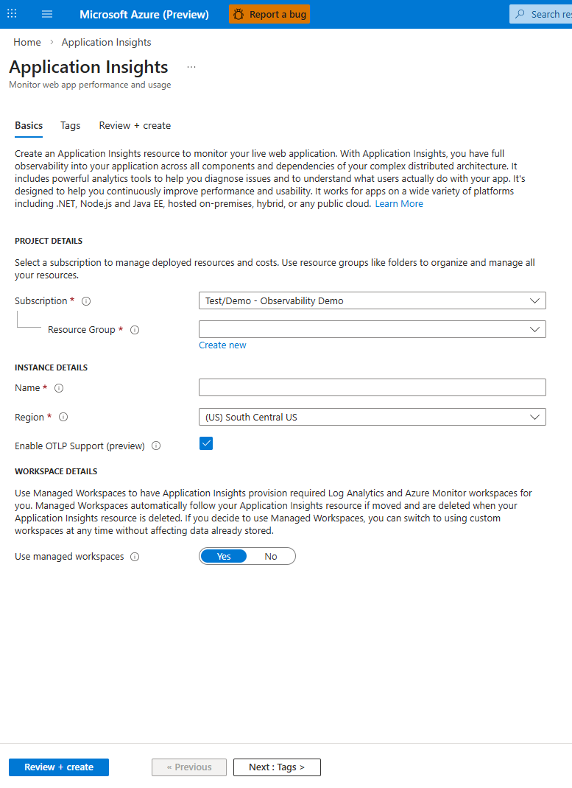
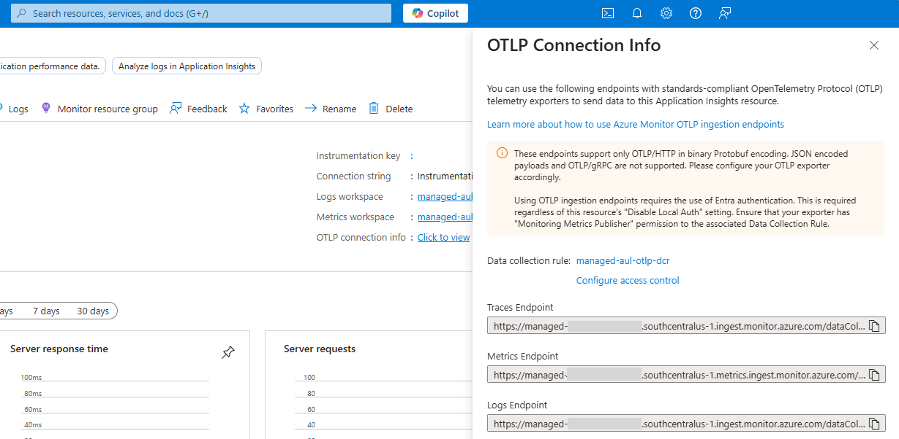
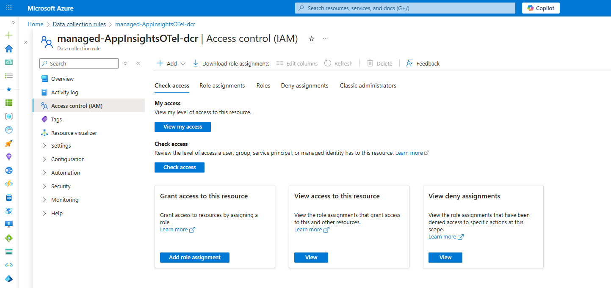
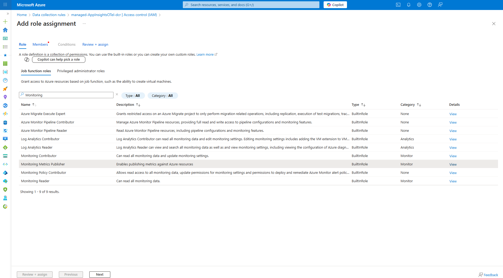
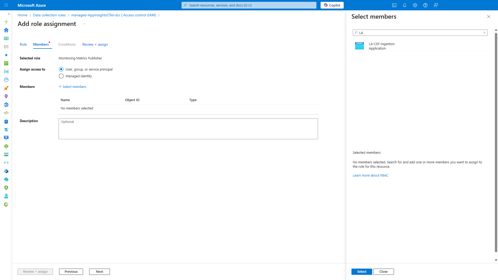
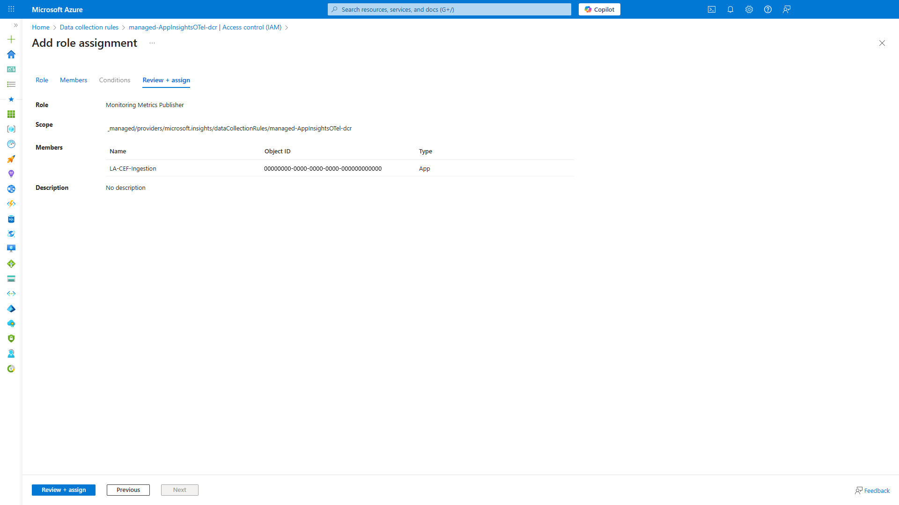

# OpenTelemetry Support in Azure Monitor - Limited Public Preview
## Overview

Azure Monitor is expanding its OpenTelemetry support to include native
ingestion of OTLP signals via the following mechanisms:

1.  Via OTel Collector sent to the Azure Monitor cloud ingestion
    endpoint directly.

2.  Via local Azure Monitor Agent (VM/VMSS/Arc supported computing
    environments).

3.  From applications on Azure Kubernetes Service (AKS) via addOn

This document covers the OTel Collector and AMA methods. For AKS, follow the instruction on the [Azure Monitor documentation](https://learn.microsoft.com/azure/azure-monitor/app/kubernetes-open-protocol)


## Preview Notes

Please [sign up](https://aka.ms/AzureMonitorOTelPreview) for the preview for support, Q&A and to share feedback before onboarding.

Thank you for participating in this preview. We would love to address
any issues or questions you may have and would greatly appreciate any
feedback on what worked well/or did not. Please email us at
<otel@microsoft.com>.

Use [OpenTelemetry SDKs](https://opentelemetry.io/docs/languages/) (any language) to instrument the application.

# Onboarding

There are 2 steps to onboarding – setting up Azure Monitor to receive
the OTLP signals and configuring your environment to send telemetry to Azure
Monitor.

## Set up OTLP signal collection

We recommend that you create an Application Insights resource with OTLP enabled that automatically deploys the Azure resources required to ingest and store OTLP signals. This approach also allows you to use Application Insights troubleshooting experiences on the ingested data.

Alternatively, you may choose to create the Data Collection Rules, Data Collection Endpoints, and workspaces on your own and optionally associate the OTLP data with an Application Insights resource.

### Option 1: Orchestrate collection with AppInsights resource (Recommended)

With this option, all required Azure artifacts will be automatically created and the required links between them automatically set up. You will also be able to use Application Insights for application performance monitoring including perfomance and failure analysis, topology views, and end-to-end troubelshooting with distrubted tracing.

Create a new Application Insights resource and ensure that the **Enable OTLP support** check box selected.



Navigate to the Overview page of the Application
Insights resource (thatwas just created) to retrieve the OTLP Connection
Info as shown below.



Copy the link to the DCR from the screen above. Also copy the endpoint
URLs, you will need them if you are using OTel Collector. You can now skip
ahead to the [Configure your environment](#configure-your-environment)
section now.

### Option 2: Orchestrate on your own

This option requires you to set up the Data Collection Endpoints,
the Data Collection Rules, Log Analytics and Azure Monitor workspaces
for the collection of OTLP signals. Optionally, for out of the box troubleshooting
experiences, you will need to create and associate an Application
Insights resource with your OTLP data.

#### Set up your destination workspaces

If you don’t already have an Azure Monitor Workspace (AMW) and Log
Analytics Workspace (LAW), create those first. Create them with your preferred means and copy their resource IDs.

#### Set up an AppInsights resource for troubleshooting experiences

An Application Insights resource is the Azure Monitor entry point to use
out-of-the-box application performance monitoring experiences.

- If you would like to use these experiences, the [OTLP_DCE_DCR_ARM_Template](https://github.com/microsoft/AzureMonitorCommunity/blob/master/Azure%20Services/Azure%20Monitor/OpenTelemetry/OTLP_DCE_DCR_ARM_Template.txt) that is used later has parameter for that. Simply create an AppInsights resource in the same region (disable the “Enable OTLP Support” to prevent creation of unnecessary resources, you are self-orchestrating it here), and copy its resource ID.

- If you do not want to do so, then update the template to remove the
  Application Insights resource and the following references to it.

> "enrichWithReference": "applicationInsightsResource",
> "replaceResourceIdWithReference": true,

#### Set up Data Collection Endpoint (DCE) & Data Collection Rule (DCR)

A DCE is an Azure resource that defines a set of endpoints to ingest
data into Azure Monitor. DCE must be in the same region as the
destination workspaces (AMW & LAW). A DCR is an Azure resource that
defines how the logs, metrics and traces will be collected and routed to
your destinations (AMW & LAW).

1.  Go to the Azure portal, and search for “Deploy a custom template”.

2.  Choose “Build your own template in the editor”

3.  Copy and paste the template from the [OTLP_DCE_DCR_ARM_Template](https://github.com/microsoft/AzureMonitorCommunity/blob/master/Azure%20Services/Azure%20Monitor/OpenTelemetry/OTLP_DCE_DCR_ARM_Template.txt) in the Azure Monitor Community repo.


Set location to the same region where your workspaces are deployed.

Copy the link to the DCR you have created. Azure Monitor is now ready to
receive the OTLP signals.

## Configure your environment 

If your OTel SDK instrumented application is running on Azure VM/VMSS or any
Azure Arc supported compute platform, we recommend using the Azure Monitor Agent.
On other compute platforms, you can channel the OTLP signals using the community OTel
Collector with some additional configuration.

### Option 1: Using AMA on VM/VMSS/Arc supported compute (Recommended)

You will need to get the right AMA version deployed and then set up the
DCR associations to those resources.

#### Deploy AMA

Use CLI/Powershell to deploy AMA. See this for instructions: [Install
and Manage the Azure Monitor Agent](https://learn.microsoft.com/azure/azure-monitor/agents/azure-monitor-agent-manage?tabs=azure-powershell)

On Windows you need AMA version **1.38.1*** or
higher. On Linux, it is **1.37.0** or higher.

#### Set up DCR Associations

Go to the DCR you created with either option in the [Setup OTLP Collection 
step](#set-up-otlp-signal-collection). Follow the instructions here to simply set up the associations
linking the DCR you created with either option above to the VM/VMSS/Arc
compute resource(s) that are running the OTel SDK instrumented
application:

[Manage data collection rule associations in Azure Monitor](https://learn.microsoft.com/azure/azure-monitor/data-collection/data-collection-rule-associations?tabs=cli)

#### Set up environment variables

You need the “microsoft.applicationId” resource attribute to have the
applicationId of the Application Insights resource. It is the last
attribute in its connection string.

Ensure your OTLP signal ports are
set up correclty. Use **port 4317 (gRPC)** for metrics and **port
4319 (gRPC)** for logs and traces. The host is **localhost**.

You are all set. You can skip ahead to the [Consumption](#consumption)
section now.

### Option 2: Using OTel Collector

If you are using your own build of the OTel Collector, be sure to have
included the latest Azure Authentication module. If you are using the
default OTel Collector contrib build, be sure to be using a version
newer than 0.132.0.

You will need to set up Microsoft Entra authentication in the OTel collector to send
to Azure Monitor endpoints. Secondly, you need to configure the OTel Collector
with authentication and the endpoint URLs for metrics, logs and traces.

#### Set up Entra Authentication

Note: If your OTel SDK instrumented application is running on Azure
VM/VMSS, enable the system assigned identity and
assign it the Monitor Metrics Publisher role. You can skip ahead to
[Configuring the OTel Collector](#configure-otel-collector).

If you are using compute platforms outside of Azure, use the [Azure Auth
Extension for OTel Collector](https://github.com/open-telemetry/opentelemetry-collector-contrib/tree/main/extension/azureauthextension) to configure authentication for ingestion to Azure Monitor.

Set up auth between OTel Collector and the DCR:
 
Identify which Entra identity is being used. It could be the default system-assigned managed identity of the VM,a user-assigned identity, a workload or an app registration id.
 
Enter the clientId of that identity into the OtelCollector configuration under extensions -> azureauth/monitor -> managed_identity -> client_id. 

For system-assigned identity leave, managed_identity blank (managed_identity: {})

Note this approach may not work if there are multiples identities available and it's not clear which one to include in the token.

Example
```
data:
  relay: |
    exporters:
      otlphttp/azuremonitor:
        traces_endpoint: "https://<traces_endpoint>/v1/traces"
        logs_endpoint: "https://<traces_endpoint>/v1/logs"
        metrics_endpoint: "https://<traces_endpoint>/v1/metrics"
        auth:
          authenticator: azureauth/monitor
    extensions:
      azureauth/monitor:
        #managed_identity: {}
        managed_identity:
          client_id: "xxxxxxxx-xxxx-xxxx-xxxx-xxxxxxxxxxxx"
        scopes:
          - https://monitor.azure.com/.default
```

#### Assign permissions to your DCR

The idenity or application you set up for Entra authentication needs to be given permission to the DCR you set up earlier. This will allow your OTel instrumented application, when
using the correct application ID and application Key to send data to the
new DCR. 

1.  Go to your OTel DCR in the Azure Portal, select **Access Control (IAM)**, and  **Add Role Assignment**. 

 

2.  Select Monitoring Metrics Publisher and select Next.  

 

3.  Select User, Group, or Service principal for Assign Access to and
    choose Select members. Select the application that you created and
    choose Select. 

 

4.  Select Review + Assign and verify the details before you save your
    role assignment. 



#### Craft the URLs

Note: If you used Application Insights resource to orchestrate data
collection set up, you have the trace/logs/metrics endpoint URLs handy
already. Skip ahead to [configuring OTel
Collector](#configure-otel-collector).

If you chose to orchestrate yourself:

1.  Go to the DCE you set up, and click on JSON View

[JSON View on the Overview page of a DCE resource]

Copy the logsIngestion and metricsIngestion endpoints, they will look
like the following:

"logsIngestion": {

"endpoint": "https://XYZ.southcentralus-1.ingest.monitor.azure.com"

},

"metricsIngestion": {

"endpoint":"https://XYZ.southcentralus-1.metrics.ingest.monitor.azure.com"

},

These are your **Logs-DCE-domain** and
**Metrics-DCE-domain** you will use in the URL
pattern.

2.  Go to the DCR you set up, and get the “Immutable ID” from the
    overview page:  

[Immutable ID from the overview page of a DCR resource]

> This is the **DCR-ImmutableID** in the URL pattern.


3.	Replace those values into the following to get your endpoint URLs:

Metrics:

https://\<metrics-DCE-domain>/datacollectionRules/\<dcr-immutableId>/streams/microsoft-otelmetrics/otlp/v1/metrics

Logs:

https://\<Logs-DCE-domain>/datacollectionRules/\<dcr-immutableId>/streams/opentelemetry_logs/otlp/v1/logs

Traces:

https://\<Logs-DCE-domain>/datacollectionRules/\<dcr-immutableId>/streams/opentelemetry_traces/otlp/v1/traces

> Note – traces URL uses the Logs DCE domain.


#### Configure OTel Collector

Here’s a [sample OTel Collector configuration file](https://github.com/microsoft/AzureMonitorCommunity/blob/master/Azure%20Services/Azure%20Monitor/OpenTelemetry/SampleOTelCollectorConfig.yaml)


## Limitations

Regions not supported in Preview:
- North Central US
- Qatar Central
- Poland Central
- New Zealand North
- Malaysia West
- Indonesia Central
- West India
- Chile Central
- Mexico Central
- Austria East