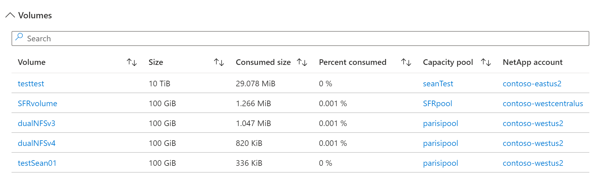

## Azure NetApp Files

### Workbooks

- [Azure NetApp Files overview](https://raw.githubusercontent.com/microsoft/AzureMonitorCommunity/master/Azure%20Services/Azure%20NetApp%20Files/Workbooks/Azure%20NetApp%20Files%20overview.workbook) - This workbook provides a summary of your Azure NetApp Files environment and includes information about your NetApp accounts, capacity pools, and volumes.

### How to deploy a workbook

1. Within the Azure portal, navigate to ```Azure Workbooks```
1. Click the ```+ Create``` button
1. Click the ```+ New``` button
1. Click the ```</>``` (Advanced Editor) button
1. Leave the selector as ```Gallery Template```
1. Open one of the workbook links above in a new browser tab/window
1. Copy the entire contents of the page in to the ```Advanced Editor``` window replacing the contents ***completely***
1. Click ```Apply``` on the right-hand side of the ```Advanced Editor``` window
1. Click ```Done Editing```
1. Click the ```Save``` icon and give your Workbook a ```Title``` and ```Resource group```
1. Click ```Apply```

### It should look like this...





### Feedback? Feature requests?

If you have feedback or would like to request new features, please create a ```New issue``` [here](https://github.com/microsoft/AzureMonitorCommunity/issues).