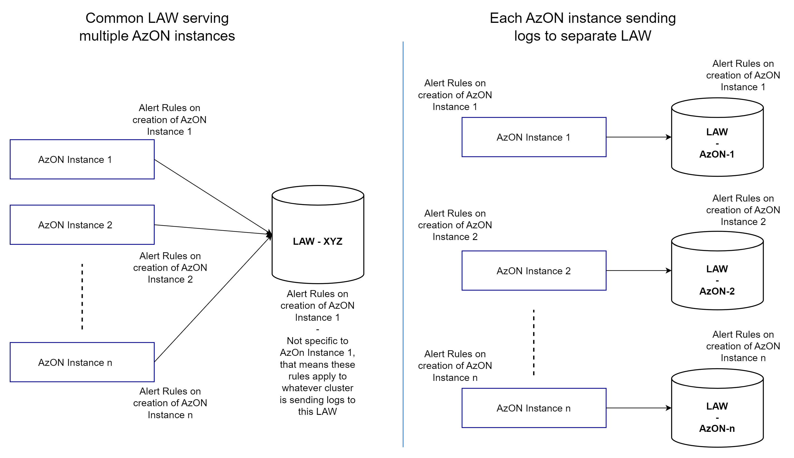

# Azure Operator Nexus (AzON) Logging, Monitoring, and Alerting

## Overview

This folder contains sample workbooks and alert rules related to Azure Operator Nexus (AzON) Logging, Monitoring and Alerting.
It provides various ARM templates for use by customers to deploy selected resources.

### Prerequisites

The samples require one or more AzON instances connected with a Log Analytics Workspace. An AzON instance will deploy
all of the necessary Prometheus exporters, which will provide the metrics supporting these workbooks and alert rules.

## Azure Workbooks

These instructions will let you deploy an Azure Workbook within your Log Analytics Workspace as mentioned through the
parameter. You'll have the ability to select the Arc-enabled Cluster associated to that Log Analytics Workspace and
see the data for a particular cluster. You can select the timerange to see data for a particular timeframe.

In the workbooks/templates folder, there's a workbook for hardware validation. You should deploy this workbook on
Log Analytics Workspace related to Cluster Manager (and not Cluster). One hardware validation workbook per Cluster Manager.
This workbook allows you to view data collected from executions of hardware validation from among all the clusters
associated to this Cluster Manager instance.

### Workbooks Folder Structure

AzureMonitorCommunity repository path:  **`Workbooks/Preview/armTemplates`**

- `deployWorkbooks.sh` - Shell script utility for deploying all workbooks to a Log Analytics Workspace
- `/templates` - Folder contains workbook templates

The following sections describe these resources in greater detail.  You can deploy the sample workbooks one at a time
or use scripting to deploy multiple workbooks.

### Individual Workbook Deployment

To use the Azure CLI to deploy a workbook ARM template, sign in to the Azure CLI and set your subscription.

``` sh
    az login
    az account set -s "<SUBSCRIPTION_NAME_OR_ID>"
```
where
- **<SUBSCRIPTION_NAME_OR_ID>** = name or ID of subscription where deployment will be created

Based on the <RG_FLAG> set by the user, the workbooks will be deployed in the correct Resource Group.
where
- **Y** = Cluster Manager Resource Group
- **N** = On-Prem Resource Group

Deploy a single workbook in your resource group using the following command:

```sh
    az deployment group create \
        --name "<DEPLOYMENT_NAME>" \
        --resource-group "<RESOURCE_GROUP>" \
        --template-file "<PATH_TO_TEMPLATE_FILE>" \
        --parameters workspaceLAW="<WORKSPACE_LAW>" \
        --parameters workbookLocation="<AZ_LOCATION>"
```
where
- **<DEPLOYMENT_NAME>** = name for the deployment
- **<RESOURCE_GROUP>** = resource group name
- **<PATH_TO_TEMPLATE_FILE>** = path to selected workbook ARM template in `templates/`
- **<WORKSPACE_LAW>** = Log Analytics Workspace name
- **<AZ_LOCATION>** = Region in which to create the workbook

### Workbook Deployment Scripting
A sample shell script (`deployWorkbooks.sh`) that you can use to deploy all of the sample workbooks.
You can invoke the script with the following environment variables set or passed as arguments, if you didn't set a value
the script will prompt for it.

- `RESOURCE_GROUP` - The resource group in which the Log Analytics Workspace is located
- `WORKSPACE_LAW` - The name of the Log Analytics Workspace within the resource group
- `RG_FLAG` - The resource group type, whether it's a Cluster Manager resource group [Y/N]
- `AZ_LOCATION` - *Optional* - The region in which the workbooks should be created.  Defaults to same region as Log
Analytics Workspace.

You can run the script from the workbooks folder:

```sh
  ./deployWorkbooks.sh $RESOURCE_GROUP $WORKSPACE_LAW $RG_FLAG $AZ_LOCATION
```

### Built With

<https://docs.microsoft.com/en-us/azure/azure-monitor/visualize/workbooks-automate>

## Alert Rules

The Alerts ARM templates subfolder contains sample scripts, ARM templates and associated parameter files that you can
run to create alert rules.

### Alert Rules Folder Structure

AzureMonitorCommunity repository path:  **`Alerts/Preview/armTemplates`**

- `deployActivityLogAlerts.sh` - Shell script utility for creating resource health alerts on Arc connected Kubernetes cluster
- `deployMetricAlerts.sh` - Shell script utility for creating metric alert rules on an AzON cluster
- `deployScheduledQueryRules.sh` - Shell script utility for creating log alert rules on a Log Analytics Workspace
- `/templates` - Folder contains ARM templates for use in deploying
[alert rule types](https://docs.microsoft.com/en-us/azure/azure-monitor/alerts/alerts-types).
These templates expose parameters that specify alert rule settings that you can set using parameter files or directly
on the command line.
  - `activityLogAlerts.bicep` - For Resource health alert rules
  - `metricAlerts.bicep` - For Metric alert rules
  - `scheduledQueryRules.bicep` - For Log alert rules.  This template also defines some Kusto
[user-defined functions](https://docs.microsoft.com/en-us/azure/data-explorer/kusto/query/functions/user-defined-functions)
used by queries in the parameter files to encapsulate some common approaches for
[querying Prometheus metrics](https://docs.microsoft.com/en-us/azure/azure-monitor/containers/container-insights-log-query#query-prometheus-metrics-data)
scraped by Azure Container Insights.
- `/activityLogAlerts` - Folder contains parameter files each containing settings for sample resource health alert rule
- `/metricAlerts` - Folder contains parameter files each containing settings for sample metric alert rule
- `/scheduledQueryRules` - Folder contains parameter files each containing settings for sample log alert rule

The following sections describe these resources in greater detail.  The sample alert rules you can deploy one at a
time or use scripting to deploy multiple alert rules.

### Create Action Groups

When Azure Monitor data indicates that there might be a problem with your infrastructure or application, an alert is
triggered. Azure Monitor then use action groups to notify users about the alert and take an action. An Action Group is
a collection of notification preferences that are defined by the owner of an Azure subscription.

Operators can create an Action Group that they deem suitable for their alert rules. They can then provide that during
deployment to the alert rules in the next steps.

Documentation to create Action Group: https://docs.microsoft.com/en-us/azure/azure-monitor/alerts/action-groups

### Deployment

To use the Azure CLI to deploy an alert rule ARM template, sign in to the Azure CLI and set your subscription.

``` sh
    az login
    az account set -s "<SUBSCRIPTION_NAME_OR_ID>"
```
where
- **<SUBSCRIPTION_NAME_OR_ID>** = name or ID of subscription where deployment will be created

#### **Log Alert Rules**



You can apply Log query alert rules to a Log Analytics Workspace where logs from one or more AzON clusters are collected.
These alert rules rely on log query results to trigger and attach to the appropriate resource producing the log.
Deploy a single sample log query alert rule using the following command:

```sh
  az deployment group create \
    --name "<DEPLOYMENT_NAME>" \
    --resource-group "<RESOURCE_GROUP>" \
    --template-file "<PATH_TO_TEMPLATE_FILE>" \
    --parameters @"<PATH_TO_PARAMETER_FILE>" \
      resourceId="<LAW_RESOURCE_ID>" location="<AZ_LOCATION>" \
      actionGroupIds="<ACTION_GROUP_IDS>" \
      <PARAM_NAME>="<PARAM_VALUE>"...
```

where
- **<DEPLOYMENT_NAME>** = name for the deployment
- **<RESOURCE_GROUP>** = resource group where the alert rule will be created
- **<PATH_TO_TEMPLATE_FILE>** = path to `templates/scheduledQueryRules.bicep`
- **<PATH_TO_PARAMETER_FILE>** = path to parameter file in `scheduledQueryRules/` for alert rule to be created
- **<LAW_RESOURCE_ID>** = Full Resource ID of the AzON Log Analytics Workspace
- **<AZ_LOCATION>** = Region in which to create the log alert rule
- **<ACTION_GROUP_IDS>** = Optional comma-separated list of Action Group resource IDs to be associated to the alert
rule.
- **<PARAM_NAME>="<PARAM_VALUE>"** = Optional name/value pairs that can override other parameter file values

### Log Alert Rule Deployment Scripting
A sample shell script (`deployScheduledQueryRules.sh`) that you can use to deploy all of the sample log query alert rules.
You can invoke the script with the following environment variables set or passed as arguments, if you didn't set a value
the script will prompt for it.

- `RESOURCE_GROUP` - The resource group in which the Log Analytics Workspace is located
- `WORKSPACE_LAW` - The name of the Log Analytics Workspace within the resource group
- `AZ_LOCATION` - *Optional* - The region in which the alerts should be created.  Defaults to same region as Log
Analytics Workspace.
- `ACTION_GROUP_IDS` - *Optional* - Comma-separated list of action group resource IDs

You can run the script from the alert rules folder:

```sh
  ./deployScheduledQueryRules.sh $RESOURCE_GROUP $WORKSPACE_LAW $LOCATION $ACTION_GROUP_IDS
```

#### **Metric Alert Rules**

You can apply Metric alert rules to an AzON Undercloud Arc-Connected K8s Cluster that emits metrics that the alert rules
monitor. Deploy a single sample metric alert rule using the following command:

```sh
  az deployment group create \
    --name "<DEPLOYMENT_NAME>" \
    --resource-group "<RESOURCE_GROUP>" \
    --template-file "<PATH_TO_TEMPLATE_FILE>" \
    --parameters @"<PATH_TO_PARAMETER_FILE>" \
      resourceId="<CLUSTER_RESOURCE_ID" \
      actionGroupIds="<ACTION_GROUP_IDS>" \
      <PARAM_NAME>="<PARAM_VALUE>"...
```

where
- **<DEPLOYMENT_NAME>** = name for the deployment
- **<RESOURCE_GROUP>** = resource group where the alert rule will be created
- **<PATH_TO_TEMPLATE_FILE>** = path to `templates/metricAlerts.bicep`
- **<PATH_TO_PARAMETER_FILE>** = path to parameter file in `metricAlerts/` for alert rule to be created
- **<CLUSTER_RESOURCE_ID>** = Full Resource ID of the AzON cluster emitting the metric
- **<ACTION_GROUP_IDS>** = Optional comma-separated list of Action Group resource IDs to be associated to the alert
rule.
- **<PARAM_NAME>="<PARAM_VALUE>"** = Optional name/value pairs that can override other parameter file values

### Metric Alert Rule Deployment Scripting
A sample shell script (`deployMetricAlerts.sh`) that you can use to deploy all of the sample metric alert rules.
You can invoke the script with the following environment variables set or passed as arguments, if you didn't set a value
the script will prompt for it.

- `RESOURCE_GROUP` - The Resource Group in which the AzON Undercloud Arc-Connected K8s Cluster resource is located
- `CLUSTER_NAME` - The name of the AzON Undercloud Arc-Connected K8s Cluster in the Resource Group that will emit the metrics
- `ACTION_GROUP_IDS` - *Optional* - Comma-separated list of action group resource IDs

You can run the script from the alert rules folder:

```sh
  ./deployMetricAlerts.sh $RESOURCE_GROUP $CLUSTER_NAME $ACTION_GROUP_IDS
```

#### **Resource Health Alert Rules**

You can apply Resource health alert rules to an Arc-Connected K8s Cluster. To deploy a single sample resource health alert rule using the following command:

```sh
  az deployment group create \
    --name "<DEPLOYMENT_NAME>" \
    --resource-group "<RESOURCE_GROUP>" \
    --template-file "<PATH_TO_TEMPLATE_FILE>" \
    --parameters @"<PATH_TO_PARAMETER_FILE>" \
      resourceGroup="<RESOURCE_GROUP>" \
      alertScope="subscriptions/<SUBSCRIPTION_ID>" \
      actionGroupIds="<ACTION_GROUP_IDS>" \
      <PARAM_NAME>="<PARAM_VALUE>"...
```

where
- **<DEPLOYMENT_NAME>** = name for the deployment
- **<RESOURCE_GROUP>** = resource group where the Arc connected resource exists. Alert rules will also be created in this Resource Group.
- **<PATH_TO_TEMPLATE_FILE>** = path to `templates/activityLogAlerts.bicep`
- **<PATH_TO_PARAMETER_FILE>** = path to parameter file in `activityLogAlerts/` for alert rule to be created
- **<SUBSCRIPTION_ID>** = subscription ID where target resource (Arc Kubernetes) lives
- **<ACTION_GROUP_IDS>** = optional comma-separated list of Action Group resource IDs to be associated to the alert rule.
- **<PARAM_NAME>="<PARAM_VALUE>"** = Optional name/value pairs, which can override other parameter file values

### Resource Health Alert Rule Deployment Scripting
A sample shell script (`deployActivityLogAlerts.sh`) that you can use to deploy all of the sample resource health alerts rules.
You can invoke the script with the following environment variables set or passed as arguments, if you didn't set a value
the script will prompt for it.

- `RESOURCE_GROUP` - The resource group where alert rule will be created
- `ACTION_GROUP_IDS` - *Optional* - Comma-separated list of action group resource IDs

You can run the script from the alert rules folder:

```sh
  ./deployActivityLogAlerts.sh $RESOURCE_GROUP $ACTION_GROUP_IDS
```

## Testing

The workbooks provide you with an ability to filter the data across Timeframe, selected Arc-enabled Cluster and the
Hostname. Make sure data is getting populated in these parameters to show the charts properly.

Alert rules may be viewed in the Azure portal when viewing a Resource Group by selecting *Alerts* from the left
navigation pane and then selecting *Alert rules* from the top of the Alerts view.
