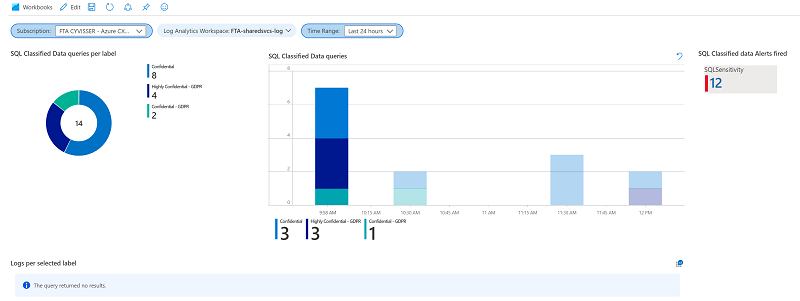

# Azure SQL ADS workbook

This workbook displays all queries which contain columns which are classified using [Data Discovery & Classification feature](https://docs.microsoft.com/en-us/azure/azure-sql/database/data-discovery-and-classification-overview)

Prerequisites are:

* [Log Analytics Workspace deployed](https://docs.microsoft.com/en-us/azure/azure-monitor/learn/quick-create-workspace)
* [Azure SQL auditing configured](https://docs.microsoft.com/en-us/azure/azure-sql/database/auditing-overview)
* [Advanced Data security enabled on Azure SQL server](https://docs.microsoft.com/en-us/azure/azure-sql/database/advanced-data-security)
* [Columns classified in one or more Azure SQL databases](https://docs.microsoft.com/en-us/azure/azure-sql/database/data-discovery-and-classification-overview)
* [Diagnostic settings configured to stream log data to the Log Analytics workspace](https://docs.microsoft.com/en-us/azure/azure-sql/database/metrics-diagnostic-telemetry-logging-streaming-export-configure?tabs=azure-portal)

## Installation 

Deploy the json file by following these [instructions](https://docs.microsoft.com/en-us/azure/azure-monitor/platform/workbooks-automate)

