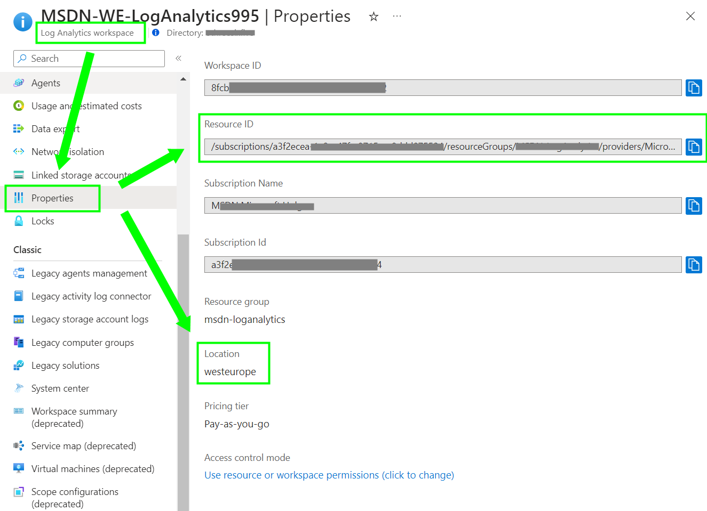

# How to get insights into App Control for Business (WDAC) events
 

## Change History

| Version | Date  | What |
| ------------- |-----| -----|
| v1.0|2024-04| first Version, publish DCR and Workbook |
| v1.1|2024-09| Upgraded Visualizations for File events. Updated Documentation|
| v1.2|2025-01| Upgraded workbook to handle SHA1 & SHA256 Hashes|

 

## Description
This scenario gives you insights into App Control for Business (WDAC) events collected from Windows machines. 
This DCR and Workbook works with any Azure VM or Arc Server resource type emmiting Application Control for Business (WDAC) windows events.

This scenario provides the next capabilities:
- Collect and send to Log analytics workspace Windows Event logs for App Control for business.
- Identify file and policy events activities, providing various dashoards, charts, filter and export capabilities to help customers analyze and troubleshoot App Control policies effects and status.
- Refine your App Control for business policies, by exporting the workbook data and ingesting it in WDAC Wizards. For more information, see [WDAC Wizard documentation](https://learn.microsoft.com/en-us/windows/security/application-security/application-control/windows-defender-application-control/design/wdac-wizard).

## Try on Portal
### Deploy DCR

The Data Collection Rule (DCR) leveraged by the Azure Monitor Agent (AMA) will collect Code Integrity/Operational Event logs channel IDs: 3076,3077,3089,3099. For more information, see [WDAC documentation](https://learn.microsoft.com/en-us/windows/security/application-security/application-control/windows-defender-application-control/operations/event-id-explanations#wdac-block-events-for-executables-dlls-and-drivers).

> [!NOTE]
> Dont forget to assign this DCR to your machines after being created to start collecting the events that fills the workbook data.

You can deploy the DCR by clicking on the buttons below: 

### Deploy Workbook

The Azure Workbook which visualize data collected by the Azure Monitoring Agent (AMA) and stored to a Log Analytics Workspace.: 

 
You can deploy the workbook by clicking on the buttons below: 

  
### Pre-requisites for using the worbook.
** **
- Install and configure Arc for Server
  Connect hybrid machines to Azure using a deployment script
  https://learn.microsoft.com/en-us/azure/azure-arc/servers/onboard-portal
  
- Install and Configure AMA agent
  Deploy Azure Monitor agent on Arc-enabled servers
  https://learn.microsoft.com/en-us/azure/azure-arc/servers/concept-log-analytics-extension-deployment
  
- Enable VM extension from the Azure portal
  https://learn.microsoft.com/en-us/azure/azure-arc/servers/manage-vm-extensions-portal
  
- Deploy DCR
  The Data collector rule (DCR) is the definition that tells the AMA agent what to collect, this is filters, enriches, and transforms the data before sending it to LA.

  Before you start the deployment of the DCR, you need to note the information of your LA workspace as explained below:
    - Go to LA workspace list in your subscription https://portal.azure.com/#browse/Microsoft.OperationalInsights%2Fworkspaces
    - Select the one you will be using, go to propierties and copy the Workspace ID and Resource ID (image below):
  
    

- Assign your DCR
    - Go to DCR section in your subscription https://portal.azure.com/#view/Microsoft_Azure_Monitoring/AzureMonitoringBrowseBlade/~/dataCollectionRules
    - Select the new deployed DCRs, the default name is “DCR-WDAC”
    - Select the DCR, go to Configuration-> Resources and Add your Arc Enabled Servers
    - Select your Arc server, select it, and click Apply. 

- Deploy Workbook
    - Go to the "Deploy Workbook section above"
    - Select Deploy to Azure or Azure Gov button
    - Select the empty setting from the template (Resource Group)
    - Select Review and Create and then Create.

  
### Worbook Usage.
** **
- View and Analyze your Data
  You can view and analyze your data in LA, currently the worbook provides:
  - File Audit/Block Events (events 3076/3077/3089)
  - Policy inventory and change tracking (event 3099)
  - Correlated events in graphic view
  - Export events
      - Visualization in Excel
      - Ingestion in WDAC Wizard
  
  To view and analyze your data in LA, follow these steps:
  - Go to your Azure Monitor Workbooks section in the Azure portal
    https://portal.azure.com/#view/Microsoft_Azure_Monitoring/AzureMonitoringBrowseBlade/~/workbooks
  - Type the search section “App Control” to find the new deployed Workbook.
  - Open the Workbook by selecting it from Azure monitor / workbooks section.
  - Navigate through the AppControl activity tabs in the workbook.

  The workbook contains many filters and visualizations, get familiar with them to undertand:
  - Identify potential malware, if missed by antimalware solutions.
  - Identify software that's banned by your organization.
  - Identity additional rules to created to “authorize” legitimate software.
    
> [!NOTE]
> To be able to visualize the data, DCR and Events should properly flow to your LA workspace, even when all is properly configured, can take up to 1h to show in the workbook.

  
