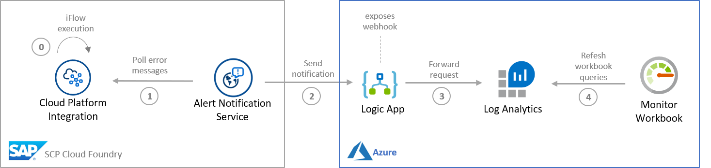
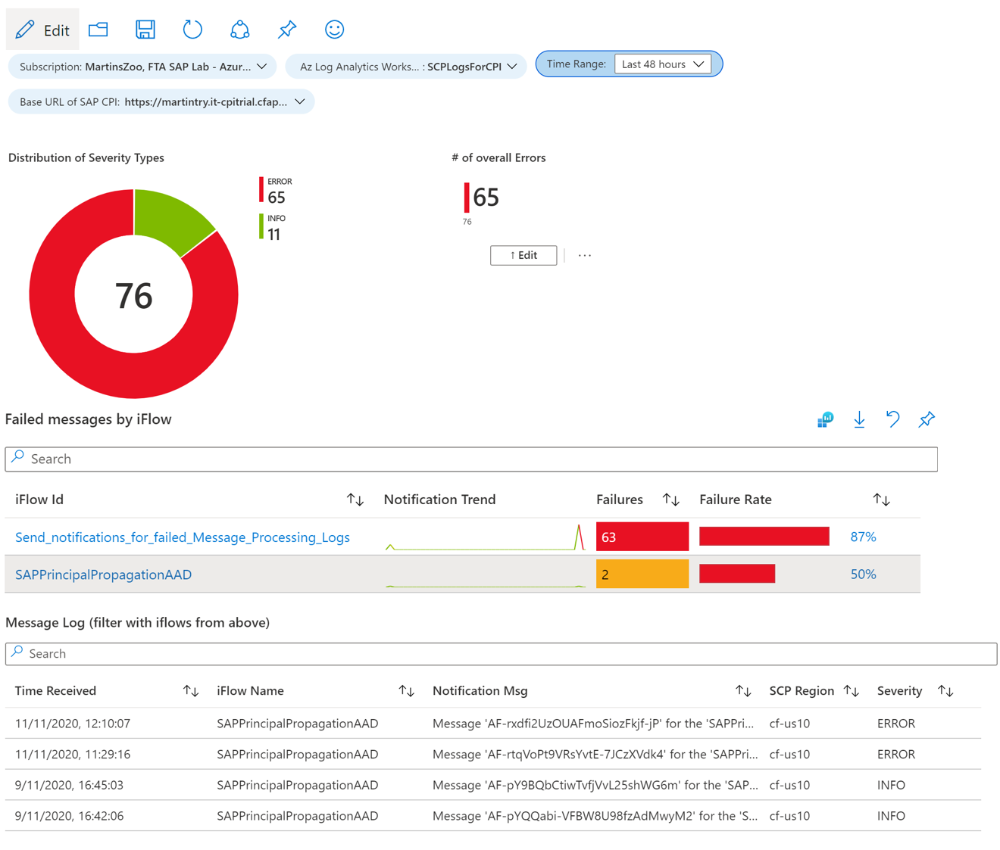

# How-To for SAP CPI Monitor for Azure

This solution provides high-level monitoring for SAP Cloud Platform Integration tenants in form of an Azure Monitor workbook. CPI is one of the most widely used SAP Cloud Platform services, which can be provisioned as part of SAP Cloud Platform on Azure. 

The workbook and its queries rely on a certain log structure that is given by the SAP Cloud Platform Alert Notification Service. Please read this [blog](https://blogs.sap.com/2020/11/11/broadcast-cpi-errors-to-azure-monitor-via-scp-alert-notifications/) to get more details on the service setup.

In addition to that the workbook allows deep linking to your SAP Cloud Platform Integration tenant.

Alerts can be created from the "Failure Rate" column of table "Failed messages by iFlow" at your convenience.

---

---

In case of questions reach out to martin.pankraz@microsoft.com